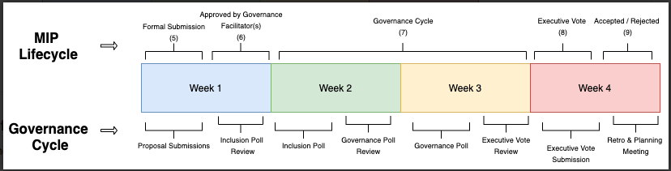
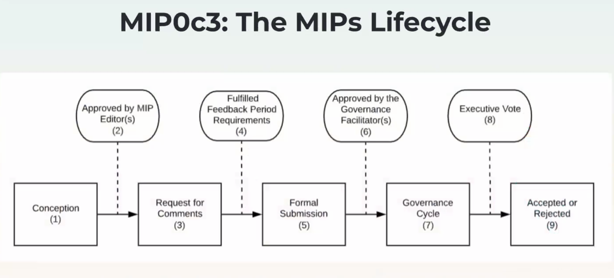

# MakerDAO

## Contents

- [Risk articles on Defi](#articles)
- [Data sources](#data)
- [Risk Governance meeting notes](#risk-governance-meetings)
- [Meeting 2019-05-31](#risk-meeting-2019-05-31)
- [Meeting 2019-06-07](#risk-meeting-2019-06-07)
- [Meeting 2019-06-14](#risk-meeting-2019-06-14)
- [Meeting 2019-06-20](#risk-meeting-2019-06-20)
- [Meeting 2019-08-23](#risk-meeting-2019-08-23)
- [Meeting 2019-10-11](#risk-meeting-2019-10-11)
- [Meeting 2019-10-18](#risk-meeting-2019-10-18)
- [Meeting 2019-12-06](#risk-meeting-2019-12-06)
- [Meeting 2019-12-13](#risk-meeting-2019-12-13)
- [Meeting 2019-12-20](#risk-meeting-2019-12-20)
- [Meeting 2020-01-03](#risk-meeting-2020-01-03)
- [Meeting 2020-01-10](#risk-meeting-2020-01-10)
- [Meeting 2020-02-10](#risk-meeting-2020-02-14)
- [Meeting 2020-02-21](#risk-meeting-2020-02-21)
- [Meeting 2020-02-28](#risk-meeting-2020-02-28)
- [Meeting 2020-03-13](#risk-meeting-2020-03-13)
- [Meeting 2020-03-18](#risk-meeting-2020-03-18)
- [Meeting 2020-03-20](#risk-meeting-2020-03-20)
- [Meeting 2020-03-21](#risk-meeting-2020-03-21)
- [Meeting 2020-03-25](#risk-meeting-2020-03-25)
- [Meeting 2020-03-27](#risk-meeting-2020-03-27)
- [Meeting 2020-04-03](#risk-meeting-2020-04-03)
- [Meeting 2020-04-10](#risk-meeting-2020-04-10)
- [Meeting 2020-04-16](#risk-meeting-2020-04-16)

- [Analytics](#analytics)

---

<a name="articles" />

## Risk Articles

Collection of relevant analytical articles to understand risk categories, metrics and analysis associated with Maker and DeFi platforms. Focus on factual data and scientific research

- [Illiquidity and bank runs in DeFi](https://medium.com/alethio/overlooked-risk-illiquidity-and-bank-runs-on-compound-finance-5d6fc3922d0d#3f8c) by [Alethio](https://medium.com/alethio)

---

<a name="data" />

## Data sources

- [Blocklytics Ethdata](https://blocklytics.org/) by Blocklytics - tool to help Python analysts and developers focus on analysis instead of pulling and decoding Ethereum data.
  + [Documentation](https://docs.blocklytics.org/ethdata/introduction)
  + [Blog](https://blocklytics.org/blog/ethdata-python-module/)
  + [Pools](https://pools.fyi/#/) - liquidity pool tracker by Blocklytics
  
- [Dune Analytics]
  
---

<a name="risk-governance-meetings" />

## Risk Governance meeting notes

<a name="risk-meeting-2019-05-31" />

### Meeting notes 2019-05-31

Analysis:

- relationship between eth and dai changed in dynamic
- supply of dai just been reducing
- age of debt has been reducing -> healthy. costs realised
- what is the right relationship between dai price and price movements? (discussion)
- eth has been taken out of collateralisation -> collateralisation ratio increasing -> impact on secondary lending -> more dai drawn out of Compound and other platforms. Note: DSR supposed to balance out the refinancing dynamic

Multi-collateral:

- collateral analysis required: collateral ratio, liquidity, debt ceiling..
- building out piece-by-piece of analysis
- framework
- SF will be different between assets
- DSR will be same between assets

Next steps:

- understanding of asset and its valuation
- evaluate the risks of asset -> build into risk premium of asset
- how fast CDPs are liquidated

---

<a name="risk-meeting-2019-06-07" />

### Meeting notes 2019-06-07

Analysis:

- derivatives and lending becoming an important part of the eth<>DAI dynamic
- refinancing from Mkr to 2nd market platforms has reduced. re: SF reduction
- discussion to have: rate changes between lending platforms
- open debt consistently getting lower than closed debt
- min time scale to see changes from SF reflected in data: **3-5 days**. hard to prevent changes in market conditions within the timescale. re:eth movement is a big indicator. important to keep an eye on 2nd market for inventory.
- collateral ratio: decreasing ratio. re: leverage-seeking behaviour. Usually drop in collateral due to drop in eth value.
- secondary lending rates: 3-5% buffer between maker and 2nd lending. borrow volumes increasing.

Risk explanation (Cyrus):

- CDP: exposure risk = insolvency of cdp. Probability of liquidation -> how bad is the exposure. **Needs modelling**.
  + Action: EAD, LGD, ECL notions need to be modelled and base the SF
  + SF needs to reflect frequency
- risk premium: compensation for risk of liquidation
- bad debt: historically all liquidation has been cleared 100%, with no impact in collateral ratio increase. If that wasn't to happen due to some reason (e.g. reputation risk), we have no
- <> likelyhood of cdp being liquidated
- collateralisation ratio <> mechanics of liquidation auction
- **important** management of changing risk profiles <> asset-based risk <> different distributions of cdps

New collaterals:

- framework: how we accept new collateral types. suggestions:
  + perceived safety of collateral
  + correlation to other assets in portfolio
- 3 steps in evaluation:
  + classificaiton of collateral
    + bearer vs non-bearer(bearer asset without counterparty risk e.g. bitcoin. non-bearer e.g. security token)
    + equity/bond tokens
  + due diligence report
    + team/tech/token sale/distribution
  + risk analysis
    + factors leading to adverse market conditions e.g. protocol risk, coding practice
    + valuation models for tokens (frameworks exist)
- community involvement:
  + risk modelling
  + dd analysis

**Work to be done**

```
- how to calculate a PUT option on ETH
```

---

<a name="risk-meeting-2019-06-14" />

### Meeting notes 2019-06-14

Governance (Richard):

- Rational behaviour being applied to voting --> maintenance of the peg, no games played on SF changes
- Question: do we need voting every week? Is delegation of voting possible (e.g. risk team)?

#### Collateral Risk (Cyrus Younessi)

'Collateral Risk Lifecycle' presentation


- Onboarding:
  + technical audit (smart contracts, connectors, adaptors )
  + risk audit (filter/prioritise assets)
  + counterparty audit
  + filter and sort
  + governance implications

- This week: Due diligence:

1. Goal

+ qualitative: find risk not immediately present in the collateral - qualitative understanding
+ scoring: convert qualitative into numeric score

2. Classification

+ bearer assets
  - type of token
  - recourse is non-factor
  - downside is high correlation

+ registered assets/STOs/wrapped tokens
  - factor counter party risk in assessment

```
Understanding of tokens to be done
```

Can be either or both bearer/registered:

- base layer tokens (eth, btc)
- utility tokens
- work tokens - get paid to do some work
- governance tokens
- staking tokens
- security tokens

3. Fundamental analysis (by risk teams)

- Team
- Technology
- Community
- Business potential
- Token
- Valuation model (ideal) - probably required e.g. `Look into BTC valuation model`

Main risks: What's the worst that can happen with...

- Money tokens (btc, eth) - Store of value risks
- Utility tokens - velocity risks (in and out of the market). Q: Is branding a factor?
- Work tokens - fork risks
- Governance tokens - value capture risks
- Staking tokens - technical risks (a lot of risks)
- Security tokens - counterparty risks

```
All risks will be input into a model --> output probability score
```

4. Risk Analysis

- Adversarial thinking/ Edge cases (How bad can it be?)
  + recourse analysis : what is the risk you don't recover any of investments
  + exchange delistings
  + poor operational management
  
- Event risk not seen in historical trading record
  + Centralised collateral
- Trader's instinct

5. Scoring framework

+ create risk ratings framework and apply to collateral

Examaple - ether

- onboarding collateral application
  + technical audit
- classification
- fundamental analysis
- risk analysis
- scoring framework -> gets transfered to the quantitative model


6. Philosophy

- conservativism
- common sense
- patience
- unbiasedness

#### Monetary Policy (Vishesh Choudry)

- increased variability in DAI price
- trading volume jump. Situation: eth being sold for DAI or DAI being bought to lever up
- dai supply. has being going down (83M). Short term effect recently with tick up at 16.5%. Also in the secondary lending platforms
- age of debt. debt has being getting younger since 19.5%. Trending has being smoothling. Also in secondary lending.
- amount of unique users in cdp has increased.
- colateralisation. rise in mid may. clearing of collateral i.e. deleveraging since eth stabilisation around 240$
- peg. volume trading slightly below 1USD. ```Maybe SF too low?```
- secondary lending behaviour. refinancing has being coming back to maker. re: abrupt spike in rates

#### Narrative (Matthew Rabinowitz)

- VaR vs DSR

---

<a name="risk-meeting-2019-06-20" />

### Meeting notes 2019-06-20

Governance Segment (Richard Brown)

- Results of the Poll
- Testing the limits of the SF
- Skipping the next SF poll, polling for better polls?

#### Risk Segment (Vishesh Choudry)

Monetary Policy:

- Dai price. Decreased volatility, with slight drift down, despite eth price comming up.

```
Question: under what conditions does ETH affects DAI?
```

- Dai supply. Slight going up. A few cdps/refinancing back to maker from secondary lending.
- Age of debt. Staddy version.
- Collateral ratio. Previous deleveraging behaviour has been balanced with a slight elevated curve.
- Distribution Dai price. Significant amount of Dai below $1
- Secondary lending. Borrow-supply has increased long term. But now has been going steddy. Most going to Maker. Re: SF at 16.5% seems to be at an appropriate level.

#### Collateral Risk (Cyrus Younessi)

'Quantitative Modeling' presentation

Recap from last week

- goal: gather all relavant info and turn into risk rating

[reference to previous week]

Agenda: quantitative analysis outline

[image]

1. Goals
Philosophical

- Dai becomes world currency
- Risk support that mission

Operational goal

- define what risk param represent
- build scientific models for these param
- assess weakness,vulnerabilities of the models
- tie decentralised governance and risk into models

2. Strategy

[image]

- Modular approach
- Academic framework -> Pragmatic
  + start with academic (ideal) framework and work through problems
  + Use of best practices
  
- Start

+ simple model with assumptions
+ conservative liquidity analysis/
+ first analysis with Eth

3. Risk model

Inputs [image]

- Collateral application
- Trading profile
  + Collet trade history
  + Curate wash trading
- Historical cdp distribution

Outputs [image]

- Preliminary outputs
  + Liquidity analysis ("slippage")
  + Collateral risk premium
- Secondary outputs
  + Correlations
- Ultimate
  +
  
4. Building models

CDPs [example on traditional loans]

Focus:

- Default risk/ credit risk

Default risk (credit risk)

- start with loss distributions -> mean of distribution
- expected loss
  + exposure amount (EA)
  + probability of default (PD)
  + Loss given default (LGD)
- applies to all collateral types

 ```
 define default: when cdp is liquidated
 ```

Expected Loss [image]

example
[image]

Goal: quantify expected amount you get back from loan. And how to estimate risk premium from that expected default.

How to calculate PD and LGD?

- Reputation used in traditional lending
  + credit scores, employment etc
  + backaward looking
  + forward looking
- desincentives to default (credit score penalty and **maker cdp**)

Collateral [image]

- two ways loan bust: non payment or collateral values falls

```
Focus on collateral
```

Types of debt [image]

- Unsecured
- Secured
**- Non-recourse (CDPs)**

Collateral only model

- update PD and LGD definitions
- no scheduled term, payments
- PD =
- LGD = expected liquidation value of collateral through recourse (**liquidation ratio**)

#### Weekly Narrative (Matthew V Rabinowitz)

---

<a name="risk-meeting-2019-08-23" />

### Meeting notes 2019-08-23

Governance Segment (Richard Brown)

- Risk team mandate
<https://forum.makerdao.com/t/mandate-interim-governance-facilitators/264>

LongForWisdom:

#### Risk Segment (Cyrus Younesssi)

Will review and discuss the Risk Teams Mandate
<https://forum.makerdao.com/t/mandate-risk-teams/282>
<https://medium.com/makerdao/makerdao-governance-risk-framework-38625f514101>

- Early days: "decentralised risk function"

How risk teams will operate:

Evaluation of risk models (principles and process)

- Dataset and data being used
  + Verify transparency
  + Filter transformations on data
- Initial risk models with METHODOLOGY used
  + How evaluate token classes
- Applied model
  + Determines the `proposed parameters`for specific token

Next month:

- General framework: determines the general risk team approach to assess tokens

How to determine risk team:

- No special priviledges

How does risk team submit risk constructs? (methodology)

Two types of risk teams:

- Sets up model parameters
- Assesses oracles

Risk team compensation

- to be confirmed (voted?)

How incentives are aligned

- Risk teams work in the best interest of MKR holders

TLDR
risk contructs and how models will be presented
risk teams approvals through voting

#### Risk Segment (Vishesh Choudry)

State of the Peg

<http://loans.descipher.io/>
<https://graphs.santiment.net/makerdao>

#### Risk Segment (Matthew V Rabinowitz)

---

<a name="risk-meeting-2019-08-23" />

### Meeting notes 2019-09-13

#### Governance Segment

Richard Brown: Results of Mandate polls (Cyrus and I aren't fired)

Update:
[Governance at a glance](https://forum.makerdao.com/t/governance-at-a-glance/84)
[Signaling process](https://forum.makerdao.com/t/current-signaling-process/396)

LongForWisdom: Governance at a Glance

- USDC request for onboarding
- Cadence of votes: one week or longer

#### Oracle Segment (Nik Kunkel)

- Head of Backend Services will continue his tour of the new Oracle systems

- Last week: oracle ecosystem within maker

+ number of proposals will be posted

- Mariano Conti

+ Original architect of oracle ecosystem

- Why are doing this?

+ gradual decentralisation of the community

[image] - oracles and defi feeds
[Image](https://lh5.googleusercontent.com/hEvf8MBZCEJ-jQB_j8Rdgb9k3H36fT7iJttX2oVsyQgTXb1LDV7G50NxvWan98HOU4KFvAEKpR0H5k8dV6Uvz0WaJogZzWMVZqySxx8Z2wAFJb33KmndFd1G9pPtGurI1Gmv9b_E)

Oracle

Feeds (def):

+ humans or organisations running bots that source price for assets and signs
+ inputs for oracle smart contracts (ie. canonical prices for sc)

Whitelisted add:

+ smart contracts that can read asset price data from feeds, against payment.
+ whitelist doesnt need to be used right away
+ whitelist add doesnt need to be paid for (necessarily)
e.g. DEX using DAI as primary asset

#### Risk Segment (Cyrus Younesssi)

**Will review and discuss the Risk Teams Mandate**

**DSR**
Where the DSR comes from? How it is created?

+ DSR contract just functionality to create new DAI, without any collateral
+ DAI created is weighted against SF. If too much DAI create, then flagged as "bad debt"

What to do with this extra cost for MKR?

+ Price up in collateral if simply pass to CDP holder
+ Would it make sense to add SF if collateral type was too popular?

Proposal:

+ Change SF once a month
+ Change DSR more often

Expectation:

+ increase in DAI supply over near future

Questions:

+ Any thoughts around a pooled model for DAI locked in DSR with an underlying token that has a claim to the asset pool? (Similar to Compound)
+ After DSR, when making changes to DSR/SF, will both be moved at the same time, or will the DSR be preferred over the SF?
+ At what rate should the global debt ceiling be increased?

Update:
[Update on DSR](https://forum.makerdao.com/t/an-update-on-dsr-and-initial-values/433)

#### State of the Peg (Vishesh Choudry)

Vishesh Choudry: State of the Peg

+ ETH stable over last week
+ Reflection in collateral locked. About same.
+ A few drops in SF
+ Debt. Amount of debt being increasing
+ As ETH price drops, increase in collateral.
+ DAI peg. Sligth over 1usd. Lower volume affects VWAP bell curve (normal distribution)
+ Secondary lending. Lending rates decreasing. dydx increased in borrow volume. compound reduced. Together: 30M
++ Decreasing SF increases borrow volume on secondary lending
++ Excess outstanding supply increasing in 2md lending. Concerning considering reducing i SF?

---

<a name="risk-meeting-2019-10-11" />

### Meeting notes 2019-10-11

#### Governance Segment

Rune: Where is maker and DeFI today? (talk at DevCon)

[image]

- composability

+ how to scale DAI to billions in supply?

- tokenised real assets into blockchain > supply side

+ upgrade legacy system

- reconcile regulation and decentralisation

+ important to all crypto
+ regulate on the edges e.g. Security tokens, Exchanges
+ diversify jurisdiction to prevent full maker crack down
+ examples: USDC, Compound

- synthetic assets (?) > demand side scale

+ emulate any asset with low overhead e.g. euro
+ no difference for MCD deploy in maker
+ consolidate liquidity
+ example: create synthetic gold related to real gold traded in markets

#### State of the Peg (Vishesh Choudry)

Vishesh Choudry: State of the Peg

+ DAI: healthy state of the peg.
+ Secondary lending: compound borrow rate more expensive than maker.
+ Outstanding supply: little change.
+ Excess supply: little increase
+ Utilization rate: compound reduncing relatively.
+ Tx volume

---

<a name="risk-meeting-2019-10-18" />

### Meeting notes 2019-10-18

#### Governance Segment

Richard Brown: Ecosystem and Governance implications of Multi-Collateral Dai launch

MCD:

- engagement with the real world
- increase of liquidity in the system
- build a portfolio of assets
- stronger security modules. mitigation of risks
- SCD and MCD work in parallel

DSR:

- subsidy of activities

Questions:

- How do we maintain stability of MCD and SCD?
- How long will we maintain MCD and SCD in parallel?
- How will we manage the upgrades of MCD with a bigger ecosystem? How will we de-risk this process?

LongForWisdom: Governance at a Glance

### Risk Segment

#### The migration process and its implications for Risk

Cyrus Younesssi

What will happen with SCD?
What will happen with Global Settlement?

MKR holders are safe guards of the user base
Risk's job:

- assess the options and suggest pathways

Migration. How it works?

- two types holders: mkr and dai (sai)
- migrate mkr and sai holders. operarational concern more than risk.
- migrate 85M sai into 85M dai. Risks in chaotic scenario:
  + supply chocks
  + pump-dump in sai and dai

- Solution: migration contract
<https://github.com/makerdao/developerguides/blob/master/mcd/upgrading-to-multi-collateral-dai/upgrading-to-multi-collateral-dai.md>
  + cdp owners: can atomically migrate with the above.
  + requires MKR migrated first
  + requires sai in the deposit contract

**How the migration governance will work?**

- From January: more proper risk models
  + risk model param at launch are conservative rather than accurate.

#### State of the Peg

Vishesh Choudry

Pricing: stable. avg 1.05usd. Majority above 1usd
Volume: 13M 7 days
DAI supply: run up amount in supply mid-sept
Collateral: slight increase in amount in the system
ETH prices: quite over last week
ETH collateral: locked is growing. Wipe: lower level of increase
ETH price and Liquidation: few liquidations recently
DEBT: responsiveness of supply to eth price
Secondary markets: borrow volumes are flat. supply volume slight increase.

---

<a name="risk-meeting-2019-12-06" />

### Meeting notes 2019-12-06

### Governance Segment

Richard Brown: Governance Challenges

LongForWisdom: Governance at a Glance

- DSR vs SF spreads

### Risk Segment

Cyrus Younesssi: Migration Status

[image]

- Total debt ceiling vs current debt ceiling
- DSR utilisation rate dropped. All exchanges have not dropped users DAI into DSR
- SAI supply has fallen re: exchange migration
- SAI vs DAI supply about 50/50
- SAI below 1usd for some months --> risk still upside if "panic"

Liquidity strategy
[image]

questions:

- "hoarding attack"?

daistats.com
sai2dai.xyz
instadapp/defisaver

### Risk Segment

Vishesh Choudry: State of the Peg

General Q&A

---

<a name="risk-meeting-2019-12-13" />

### Meeting notes 2019-12-13

#### Governance Segment

Richard Brown: Governance Challenges

LongForWisdom: Governance at a Glance

- Emergency shutdown read - interesting
- Vote for DSR as f(x) of SF
- Emergency change to SCD [post](https://forum.makerdao.com/t/signal-request-poll-when-should-we-trigger-scd-global-shutdown/935)
- Poll to activate governance security [post](https://forum.makerdao.com/t/addendum-to-the-current-poll-to-activate-the-governance-security-module/938)
- Governance security module vs monetary policy vote [post](https://forum.makerdao.com/t/in-the-case-where-an-emergency-technical-change-to-the-dcs-is-required-should-we-skip-monetary-policy-changes-in-that-weeks-executive-vote/929)

#### Technical Segment

Wouter Kampmann The Governance and Oracle Security Modules<>br
[original post](https://forum.makerdao.com/t/addendum-to-the-current-poll-to-activate-the-governance-security-module/938)

- delay: allows to inspect effects in the system -> community can remediate OR emergency shutdown mechanism
- vote also required for patching fix
- oracle security module does not need vote -> 1h to application

#### Risk Segment

Cyrus Younesssi: Migration Status<br>

- Migration: DAI more than SAI
- DSR: 4%
- DSR utilisation does not push dai price up. Move from usd to dai does.
- Higher dsr = less float
- DAI in uniswap liquidity higher than SAI
- CDP holders are still bottleneck in migration. Not dai holders.
  + strategies to push migration
- Compound has significant SAI holders

Vishesh Choudry: State of the Peg<br>

- Trading around 1usd. Light trading.
- 96% of DAI from eth. 3% from BAT.
``
More thought needed on more collateral added. Conversations on-going
``
- Borrow rate
- Compound: supply still pretty high

---

<a name="risk-meeting-2019-12-20" />

### Meeting notes 2019-12-20

#### Governance Segment

Richard Brown: General Q&A

+ Shareholders are mostly following community position

LongForWisdom: Governance at a Glance

+ Pooling
+ [Signaling requests guidelines](https://forum.makerdao.com/t/signaling-guidelines/223)
+ <https://community-development.makerdao.com/makerdao-mcd-faqs/faqs/emergency-shutdown>
+ <https://forum.makerdao.com/t/questions-discussion-on-the-emergency-shutdown/930>
+ Debt per collateral bucket: 225%-325% mostly.

```
Opportunity: run time series view of bucket collateralisation by eth price
```

#### Risk Segment

Cyrus Younesssi: Migration Status

+ Compound migration coming soon
+ Debt ceiling: DAI Debt ceiling near the limit

Vishesh Choudry: State of the Peg

+ DAI Price: around 1usd. V
+ SAI trading olume is picking activity : dydx, khyber, oasis
+ Surplus of DAI going into DSR

---

<a name="risk-meeting-2020-01-03" />

### Meeting notes 2020-01-03

#### Governance Segment

- presentation of governance model
[images]

+ [presentation](https://docs.google.com/presentation/d/10x5Z0111Lt6tOMsqhiZop53QiLLSRxqaQKVvyPY6D-U/edit)
+ [Original thread](https://forum.makerdao.com/t/signal-request-should-we-replace-the-weekly-dsr-rate-governance-poll-with-a-dsr-spread-governance-poll/969)

#### Risk Segment

Cyrus Younesssi: Migration Status

+ ETH debt ceiling 100M
+ MKR in burner - 10K
+ Worry: Compound SAI
+ Santiment: 6M SAI not moved in 1y+ --> [analysis here](https://graphs.santiment.net/makerdao-pro#event_stats)
+ Distribution: 100 addresses hold 1/3 of SAI

Vishesh Choudry: State of the Peg

+ Secondary lending SAI: not moving much
+ Parameters to consider: dsr, sf, avg borrow rates, avg lend rates
+ collateralisation ratio: measure of risk in the system - low collateral about 1/2 of DAI supply!
  + 3 CDP account for 23 out 73 MCD
+ maker burn [here](https://makerburn.com/)

---

<a name="risk-meeting-2020-01-10" />

### Meeting notes 2020-01-10

#### Governance Segment

Richard Brown: General Q&A
Derek - emergency shutdown module

#### Risk Segment

Cyrus Younesssi: Migration Status (done by Primoz)

- DAI supply pickup: new CDPs open in SAI (market makers or speculators?)
- SAI liquidity. Uniswap is only way. Slipage is increasing.
- Improved coll ratio
- DAI in DSR: increased due to addition of compound
- SAI CDPs: 7M SAI in inactive wallets; 7M in known addresses; top 100 addresses own 77% of SAI
  + Migration is limited by liquidity -> not enough SAI to pay debt on CDPs
  + Recent addition of ETH to prevent liquidation
- SF fees paid in MKR increased

Analysis at
<https://docs.google.com/spreadsheets/d/1Ba972aexu2-KQ0hyGxs8XbZZG05N-WTkmMJf6DutZxY/edit#gid=1147677054>

Vishesh Choudry: State of the Peg

- DAI VWAP breakdown
- SAI: low volumes, mostly in uniswap
- Collateration ratio: low collateral for significant %

```
Opportunity: how much of CDP activity is managed automatically
```

---

<a name="risk-meeting-2020-01-17" />

### Meeting notes 2020-01-17

#### Governance Segment

Richard Brown: General Q&A

LongForWisdom: ‘Governance at a Glance’

Mariano Conti: Maker Burn

#### Risk Segment

**Cyrus Younesssi: Debt Ceilings**

- SCD: 70M ceiling. Big gap of unused debt ceiling > option: reduce Debt ceiling
- MDC: increase in eth collateral. Will hit debt ceiling soon.  
  + Short term debt celing > no pre-eventive action to increase yet
  + Long term theoretical max DC

**Primoz Kordez: Migration Status**

- DAI supply: 89M > 12M increase since Jan 1
- SAI-DAI migration increasing (through contract)
- New draws: 20 CDPs (draws) > increasing debt (25% of debt)
- Net wipes: 27 > reducing debt
- Inacticve CDPs during migration: 32 > 12M in debt (41% of debt)

Analysis at
<https://docs.google.com/spreadsheets/d/18Et6TQZnGfuc8YJXHLFZXm75UzxigGR3wcp8VaibhdI/edit#gid=1942156439>

```
analysis opportunity: what are CDPs minting SAI doing with debt?
```

**Vishesh Choudry: State of the Pegs**

- Vaults MCD: top 20 vaults hold 44M of outstanding DAI supply

```
Opportunity: historical vault analysis required
```

**Derek Flossman : Current thinking about Tax**

- Shutdown of SAI CDPs > when global settlement occurs debt is forgiven
  + optional solution: tax penalty to CDPs
  + 6 months repayment phase followed by tax date
  
[images]

---

<a name="risk-meeting-2020-01-31" />

### Meeting notes 2020-01-31

### Governance Segment

Richard Brown: General Q&A

LongForWisdom: Governance at a Glance

#### Risk Segment

Vishesh Choudry: State of the Peg

---

<a name="risk-meeting-2020-02-" />

### Meeting notes 2020-01-31

### Governance Segment

Richard Brown: General Q&A

LongForWisdom: Governance at a Glance and 'A Very Special Thread'

[Governance dashboards](mkgov.science)

```
analysis opportunity: what kind of historical data required for governance
- increase in vote participation
- how much MKR is activate in a day (avg)
- time since last active address = measure activity
```

### Risk Segment

```
analysis: SAI risk
```

**Primoz Kordez: Migration Status**

- DAI supply: largest migration came from nexo. 2 large cdps migrated .
- Coll ratio: has increased significantly (400+). Reason? Bullish?  
- no SAI minting activity recently. makerscan
- SAI liquidity: still some liquidity in Compound

-

[defiexplore](defiexplore.com/stats) - only aggregated view of dai migration
[makerscan](makerscan.io/cups) - minting activity for SAI

```
analysis opportunity: why is coll ratio increasing? Bullish sentiment? CDP migrations?
```

[stopped at 55min of meeting - re-watch from here]

Vishesh Choudry: State of the Peg

---

<a name="risk-meeting-2020-02-14" />

### Meeting notes 2020-02-14

### Governance Segment

LongForWisdom: Governance at a Glance

- Update to the state of the peg dashboard/section
- signal request for new `ETH debt ceilling`: should maker or risk team to make decisions?
- cyrus: debt ceiling happens in incremental way due to OSM
- DAI auctions: mostly 1 person bidding [makerburnauctions](https://daiauctions.com/) and [surplus auctions](https://daiauctions.com/flap)
  + Suggestion: reduce spread in auction (min bid 3%) to encourage competition  
  + Flash loans: won't work probably..

WillBarnes: conflicting Governance attack for GSM

- Proposed solution: Dark Fix
  + Bug fix is kept secret (bytecode) --> `create_to_opcode`
  + GSM delay can be introduced
  + Cryptographically secure
  + emergency shutdown can be triggered, despite dark fix
- Trust building with community
  + MKR stakeholders sign message to signal support
- Summary
  + good balance between governance attacks vs critical vulnerability
  
- Code at [here](https://github.com/makerdao/dss-darkfix)
  
[stopped at 48min of meeting - re-watch from here]

### Engineering Section

Mariano Conti: "Dark Fixes and the GSM"

### Risk Segment

Primoz Kordez: Migration Status

Vishesh Choudry: State of the Peg

---

<a name="risk-meeting-2020-02-21" />

### Meeting notes 2020-02-21

### Governance Segment

Richard Brown: Governance Security Module: A Brief History

Current GSM Thread

- Dark Fix Thread
  + In the future: easier to shutdown and bring back up system. ie 2 transactions

- Previous Failed GSM Vote
  + Another vote will take place in 24h. Increase gsm to 24h
  + Technical emergency takes precendent over monetary policy
  + SCD is an attack vector to MCD ("back door"). Should GSM protect SCD?
  
GSM Technical Docs

LongForWisdom: Governance at a Glance

### Technical Segment

Engineering will discuss the specifics of the Governance Security Module and the 'Dark Fix'

### Risk Segment

Primoz Kordez: Migration Status

**Vishesh Choudry: State of the Peg**

+ DAI volume: Higher trading volume than normal. Mostly on Dydx.

- Coll ratio: meaninful risk. Distribution with >30% in low coll ratio
  + There was reduced eth from contracts > due to flash loan attacks?
- Debt amount: increased up until a dip
- MKR liquidity:
  + 16k > 4K liquidity in uniswap in last week -> defending system? (2 main whales)
  + a script underway for mkr liquidity from different platforms

[stopped at 48min of meeting - re-watch from here]

---

<a name="risk-meeting-2020-02-28" />

### Meeting notes 2020-02-28

### Governance Segment

- cadence poll: reduce dsr spread candence
  - [Pool vote](https://vote.makerdao.com/polling-proposal/qmxvvzb6uei1jawvtxentsbreepfkuzsohaefpw6j4vpn5)
  - [science gov](https://mkrgov.science/poll/104)
  - [thread](https://forum.makerdao.com/t/signal-request-reduce-the-frequency-of-the-dsr-spread-governance-poll/1207)
- single thread: rank choice option

Book to read: "Thinking in Systems: A Primer" by Donella Meadows.

### Oracles Segment

Nik Kunkel: Oracles and Governance

- New oracles are being built
- Oracles: are data suppliers > used for collateralisation, price
- MKR oracles are backbone of DeFi > used by many dapps
- Feeds: set of individuals/org that submit data to oracles > appointed by MKR governance
  - Dark feeds: Identities of feeds unknown > no sybil resistance; users don't trust
  - Light feeds: Orgs with public identities
    > well known with communities and brands
    > have a reputation to protect
    > ideal: hybrid between Dark and Light feeds
- Oracles v1: feeds > contracts > medianizer (median) > dsr contracts
- Oracles v2: use eth to sign feeds offchain , use gossip network > most happens **off chain**
  - feeds > scuttlebutt p2p gossip network > relayers > medianizer > oracle security module > Dai stability system / Customers & partners
  - increases scalability, reduces attack
  - Customers & partners can choose if use oracle security module or read from medianizer

- Governance: how does it play here?
- Administrative power: add/remove feeds, add/remove oracles, change delay period in OSM, manage whitelist read-access to oracles
- Current state:
  - migration from v1 to v2 at least until SCD is out
  - any oracle for free for 1 year
- Oracle team mandate
  - Risk team has mandate as SMEs

Next steps:

- Process to get whitelisted?
- How to become a light feed?
- **By next week document on processes (DRAFT)**

```
ChainLink: has problem with updates with congestion of on-chain network
```

```
Oracle v1: Maker does not know who/how they use the oracles. V2 Maker will know who/what and whitelist
```

### Risk Segment

Primoz Kordez: Migration Status

- SAI migration in migration contract (avg: 300K/day)
- active SAI cdps have been deleveraging
- share of inactive wallets is rising

Vishesh Choudry: State of the Peg

- Dai trading slightly above peg (24h)
- DyDx and Oasis activity high > dydx short term positions, higher yield
- Deleveraging happening en masse > More eth--> DAI
- Top 3 positions > 25% of supply!
- Liquidity increasing in Uniswap but not to market speed
- Auctions increased in last 24h

---

<a name="risk-meeting-2020-03-13" />

### Meeting notes 2020-03-13

### Governance Segment

Richard Brown: General Q&A

Suggestions from discussion:

- lower dsr spread
- delay debt auction time
- keeper liquidity for auctions

Links:
<https://forum.makerdao.com/t/black-thursday-response-thread/1433>
<https://github.com/makerdao/developerguides/blob/master/keepers/auction-keeper-bot-setup-guide.md>
<https://mkrgov.science/poll/110>

<https://forum.piedao.org/t/community-call-1-kick-off-defiscore-cash/59>

```
Opportunity: Any financial models been created looking at Keeper costs vs potential profits to see what kind of spread is required to be profitable/attractive to setup?
```

```
Opportunity: analyse auction bids
```

### Risk Segment

Cyrus Younessi: Collateral Risk Part 2

Vishesh Choudry: State of the Peg

---

<a name="risk-meeting-2020-03-18" />

### Meeting notes 2020-03-18

### Governance Segment

Richard Brown: General Q&A

### Risk Segment

**Vamsi’s presentation on the Flop Auction**

- PRESENTATON

**Dockerized auction keeper presentation by Marc-andre**

- Very interesting presentation

```
Opportunity: start out with docker version of keeper software (github)
```

Flop Auction: Potential executive vote to lower minimum bid. Pros/cons?

- start price for debt auction
  - do we want to decrease start price of bidding amount (current: 200)? e.g. 166 DAI per MKR
  - speculation: shall we reduce to "free market" approach ie 0 bid starting price
  > risk: inflation
- original: flop auction 48h after liquidation > increasing to 6 days
- failed auction = auction without bids

```
opportunity: liquidity analysis
```

**USDC overview / recap +
Circuit breaker discussion. When/how to use.**

- circuit breaker = liquidation freeze
- circuit breaker allows for time to reduce crunch from auctions

- issues: network congestion and dai liquidity

> node infrastructure --> related to the 6h TTL
> dai liquidity issue not solved --> ISSUE

Look at projected required DAI
<http://makervaults.descipher.io/>

- add USDC helps with DAI peg and dai liquidity crunch > DATA to prove

> reduces the issue with liquidity required for a big drop in ETH

Rational behind USDC:

```
So if the DAI price skyrockets in the event of an eth drop ppl can basically
get DAI backed by USDC so that keepers have availability of DAI to close auction lots.
```

**SCD shutdown discussion. Data collection.**

- explore.duneanalytics.io/dashboard/cdp-migration

Reasons for cdp migration (speculation)

- peth dilution if it comes to losses
- capitulation, migrate and close cdp

Reasons to migrate sai

- premium available when migrating to DAI at 13% higher price
- high dai lending rates

If eth drops, there is sai liquidity crunch > mostly below 70 USD

Summary:

- if eth keeps dropping, sai liquidity get short for auctions.
- if eth keeps dropping, incentive to migrate to DAI (premium)

---

<a name="risk-meeting-2020-03-20" />

### Meeting notes 2020-03-20

### Governance Segment

Richard Brown: General Q&A

LongForWisdom: How to manage PR as a community

LongForWisdom: Onboarding additional stablecoins to spread risk

### Risk Segment

Vamsi: Prettier version of the FLOP auction presentation

Adrian: Live walkthrough of auctions.makerdao.com 1

Cyrus: Additional USDC collateral type

---

<a name="risk-meeting-2020-03-21" />

### Meeting notes 2020-03-21

Agenda
This will be the last call in the daily “Black Thursday” series.

### Governance Segment

LongForWisdom: How to manage PR as a community

- a group will be put together

### Risk Segment

**Cyrus: FLOP Auction Results**

- 37x completed auctions, 3x remaining
- **bug**: after certain amount of time (6d?), bad debt should go into flop auctions. Some auctions got "stuck" that will be cancelled by surplus (over time). Seriousness: mild

results (positive):

- no discount for bidding price
- no disencentive from 2nd market
- minimum price bid was positive
- no issues with pricing oracle

```
analysis opportunity: analysis of dynamics within flop auctions
```

Open to a review of the weeks events and a general Q&A from Risk

Mitote: Emergency Shutdown Criteria for MCD?

- <https://forum.makerdao.com/t/what-about-emergency-shutdown-why-have-we-ignored-this-mechanism/1702>
- <https://forum.makerdao.com/t/signal-thread-scd-shutdown/1673>

Actions:

- scenarios for ES situations

---

<a name="risk-meeting-2020-03-25" />

### Meeting notes 2020-03-25

### Technical Segment

**Kurt 1: Discuss the flop unblocking 1 and the possibility for an immediate Executive Vote**

Links:

- [Forum discussion](https://forum.makerdao.com/t/blocked-flops-debt-auctions-everything-you-need-to-know/1748)
- [Slide presentation](https://docs.google.com/presentation/d/1nnpPBiOLEWi81q8zrHoIWH4s3iQaKrCSaR68AafzQJo/edit#slide=id.p)

Background:

- contract `vat`
- total debt = backed debt (summ all vault debt) + unbacked debt (from liquidations, DSR, etc)

- System balance sheet/vow
  - System surplus (day / joy)
  - System Deficit (equal to `vice` in current implementation)
- Total Queued Unbacked Debt/ sin (from liquidations)
- Unbacked debt queue
- Unbacked debt sent to auction
- Free unbacked debt


Getting system debt to reduce (2x mechanisms)

- heal
- kiss

### Governance Segment

Richard Brown 2: General Q&A

**LongForWisdom: Review Signal Thread: Do we compensate vault holders that were completely liquidated? 3**

```
If I’m interpreting Makerman’s argument correctly: even auctions that had 2/3 bid (instead of 0) would still have resulted in the entire loss of “additional” collateral for a vault owner

yes absolutely correct, if 66% bid was claimed they swtill would have been wiped out

I like that as an option.   A small chart pop up when someone wants to borrow DAI - collateral prices and collateral left if liquidated at that price.  90,80,70,60,50% etc..

**analysis opportunity**

- What is the best case/worst case scenarios for what users would have gotten back given market conditions?

```

links:

- <https://github.com/makerdao/mcd-cdp-portal/blob/091b84ffedcfbe290531d721a2ef8b60d13b5090/src/languages/_english.js#L212>

Links:

- [Maker crisis medium](https://medium.com/dragonfly-research/daos-ex-machina-an-in-depth-timeline-of-makers-recent-crisis-66d2ae39dd65)
- [Liquidation at 0 DAI](https://medium.com/@whiterabbit_hq/black-thursday-for-makerdao-8-32-million-was-liquidated-for-0-dai-36b83cac56b6): best case - most needed 13207.5153  = .21* reported ETH in
- [Black Thurs Defi Saver](https://medium.com/defi-saver/black-thursday-at-defi-saver-3c35ea6cd0d0)

---

<a name="risk-meeting-2020-03-27" />

### Meeting notes 2020-03-27

### Governance Segment

Richard Brown 1: Preamble

**Rich Cuellar-Lopez: Emergency Shutdown Working Group**

Who:

- create a working group for defi consortium
- mostly for people not part of foundation
- couple of members for each protocol with "skin in the game": Compound, Uniswap

What:

- timeline for ES
- what should be done during ES
- review docs put together

LongforWisdom: Forum ‘Governance at a Glance’

- [Steps for SCD shutdown - process](https://forum.makerdao.com/t/signal-thread-scd-shutdown/1673/20)

### Technical Segment

**Kurt 1:**
Discuss the results of the Flop forum Poll
The need for a ‘delay’ added to the spell?

Links:

- [Signal thread](https://forum.makerdao.com/t/signal-thread-finishing-flops-and-current-executive/1795)

```
analysis opportunity: does monetary policy has the expected effects? Look into decisions made (votes to change) and expected results vs actual results of actions ==> Monetary Policy Tracker
```

**Mariano 1: MKR token authority**

Links:

- [mkr authority](https://forum.makerdao.com/t/mkr-token-authority-transfer/836)
- [blog post: transfer of mkr token control](https://blog.makerdao.com/the-transfer-of-mkr-token-control-to-governance-the-final-step/)
- [blog post: transfer of control system](https://blog.makerdao.com/transfer-of-mkr-token-control-a-giant-leap-toward-system-decentralization/)

- SCD
  - owner: multisig mkr foundation
  - authority: no one

  

- MCD
  - owner: 0x0
  - mkr authority: governance (root)
  
  
  
> Note: The governance now becomes really important for several decisions, including auctions.

### Risk Segment

**Marko: USDC Analysis**

Links:

- []()

Why:

- there is ongoing discussion happening on use of USDC: flop auction, peg management
- what do we want from collateral type going forward?

Analysis:

- 40% of debt for shorting dai (peg management)
- 50% DAI accumulation  ==> account related to keeper ==> largest ETH supplier in compound

Main take away: @cyrus

- half: flop actions
- half: peg management/shorting DAI (arbitrage)

Should we add a USDC collateral type-A and collateral type-b?

**Primoz Kordez: Migration Status**

Links:

- explore.duneanalytics.io/dashboard/cdp-migration
- <https://daistats.com/>

**Vishesh Choudry: State of the Peg**

Links:

- <http://descipher.io/>

- DAI peg: price of DAI hovering around 1.02 usd  

-

---

<a name="risk-meeting-2020-04-03" />

### Meeting notes 2020-04-03

### Governance Segment

Richard Brown: General Q&A

**Rune Christensen 1: The Self-Sustaining MakerDAO Initiative**

- what the future of the project will look like

Links:

- <https://blog.makerdao.com/foundation-proposal-v2/>
- <https://forum.makerdao.com/t/announcement-kickstarting-the-self-sustaining-makerdao-initiative/1864/3>
- <http://ada.evergreen.edu/~arunc/brun/paradigms.html>
- <https://github.com/status-im/liquid-funding/>
- <https://techterms.com/definition/mips>

Core principles:

- decentralisation to accelerate post MCD
- new generation of governance and independent contributors
- in 2yr the foundation will dissolve

Pillars: forms Governance Paradigm

- elected paid contributors & domain teams
- maker improvement proposals -> structured way to submit/formalise ideas
- vote delegates

> Risk teams as "public servants"

Governance:

- Maker MUST be able to cover all potential risks
- Governance processes pre-defined before hand + practical experience
- Polished tech, documentation and system needed

Elected paid contributors & Domain teams:

- Security & dev of protocol
- Risk teams
- Contributors paid through governance & be fully transparent/horizontal
- Domain specialists & special authority e.g. param inputs
- Domain teams need to be diversified
- Critical operations to consider: HR, Legal

Maker Improvement Proposals:

- Processed from governance to engineering
- Processes formalised through MIPs framework -> clear language
- Needs to be adaptative of the DAO

Governance Paradigm:
- group of MIPs + team of EPCs so DAO can self sustain
- Foundation comes with 1st draft w/ input from community
- Core community members/delegates spearhead using/understading/controlling practical experience

Timing: safety first

**Q&A:**

*How will contractors be paid?*

- most self employed members to protocol and paid by protocol

### Risk Segment

Vishesh Choudry: State of the Peg

```
> stopped at 6.18AAM before Risk segment
```

---

<a name="risk-meeting-2020-04-10" />

### Meeting notes 2020-04-10

### Governance Segment

- SCD shutdown 24 April

**Charles St.Louis: Review of MIP3 - Governance Cycle**

Links: 
- [Blog post](https://forum.makerdao.com/t/announcement-kickstarting-the-self-sustaining-makerdao-initiative/1864)
- [MIP3 Governance Cycle](https://forum.makerdao.com/t/mip3-governance-cycle/1905)
- [MIP0 Proposal Framework](https://forum.makerdao.com/t/mip0-the-maker-improvement-proposal-framework/1902)

Dates:
- : Consultation period
- May 1-4: voting 

MIP0: Base MIP

MIP3: Governance cycle
- Monthly
- Week by week breakdown



**LongForWisdom: Governance at a Glance**

- Plug-in for signalling 

### Technical Segment

**Wil Barnes: Revisiting GSM Delay & Dark Spell Social Layer Discussion**

*GSM* 
- delay 4h

*Dark spell social layer*
- patch a bug without exposing on-chain issue
- critical bug: at least 10% of collateral value
- exceptional circumstance use
- proposed models :
  - Major MKR Holders model
  - Independent auditor attestation model
  - Community appointed trusted party model

**Mariano Conti: Technical Requirements for SCD Shutdown.**

- 3M in migration contract
- 2 weeks from shutdown
- migration needs to be drained before shutdown

Ideas:


### Risk Segment

**Cyrus Younessi 1: New series of Risk calls next week**
- Additional Tues & Wed calls 
- 10 AM PST

**Maker_Man: 0 Bid Vault Auction Modelling**

Link: 
- https://maker-auctions.io

Summary
- liquidation data against scenarios
- scenario analysis
- compensation of vault holders
- liquidation dashboard
- liquidation report

**Vishesh Choudry: State of the Peg**

- DAI supply: 80M (800K from USDC)
- Portfolio: ETH price increase. DAI dropped a little
- DAI peg: consistently at around 1.02
- Trading volumes: low amounts 
- Secondary lending: dydx picked up in % of volume traded
- Correlation ETH-DAI: inverted correlation when ETH goes down. 
- Uptick in trading and ETH activity
- collateral ratio: moved distribution up to 300-350 bucket

```
analysis: DAI going up while ETH goes up? This is unusual!
```

---

<a name="risk-meeting-2020-04-17" />

### Meeting notes 2020-04-17

### Governance Segment

**Richard Brown: General Q&A**

- Additional governance facilitator
- [signal](https://forum.makerdao.com/t/its-time-for-a-second-governance-facilitator/1998)

**Long for Wisdom: Governance at a Glance**

- confidence in the peg discussion
- signal request: delay before shutdown effective?


### Risk Segment

**Charles St. Louis: MIP0: The Maker Improvement Proposal Framework**

Links:
- [MIP0 github](https://github.com/makerdao/mips/blob/master/mip0.md)
- [MIP0 proposal](https://forum.makerdao.com/t/mip0-the-maker-improvement-proposal-framework/1902)
- [MIP 13 pillars](https://forum.makerdao.com/t/the-release-of-the-13-initial-maker-improvement-proposals-mips/1915)

Structure of MIPs: 
- preamble
- summary
- components

MIPs Lifecycle




**Vishesh Choudry: State of the Peg**


---

<a name="risk-meeting-2020-04-22" />

### Meeting notes 2020-04-22

Link:
- [State of the Peg article](https://forum.makerdao.com/t/action-required-state-of-the-peg/2025)
- [Polling proposal](https://vote.makerdao.com/polling-proposal/qmwzwvfdi8qtjh8dkggjpqxysu3qjg2gegpuar2nh7ucer)
- [DEfi.ai website](https://defi.ai/dai)
- [Wbtc](https://app.deversifi.com/BTCUSD)

### Agenda
Let’s have a call to discuss the community’s intentions in light of the recent call to action in the forums.

We’ll discuss:

- Possible collateral additions to increase liquidity
- Possible scheduling options to implement the new collateral types


### Governance Segment

**Richard Brown: Intro**
- Theme behind: blog post above 

### Risk Segment

**Cyrus Younessi and Team: Rapid Collateral Onboarding Options and other Contingency Plans to restore the peg.**

Options considered: 
- Link
- Additional stablecoins
- Change existing USDC param

Risks: 
- Rush through onboarding process
- Diff risks whether existing USDC or new collateral
- New collateral requires smart contracts and adaptors (technical level)

Most likely (easiest) 
- Adjusting param of USDC
- Purpose: DAI peg management

Risks: 
- counter party risk 
- liquidation for USDC as disabled in system now! (Cyrus)
- important consideration: liquidity requirement for assets to be used in auctions (increases slippage risk)

```
analysis opportunity: impact of not being able to liquidate USDC on Maker (> Probability of Liquidation model)
```

Other (unorthodox): 
- TRFM implementation 
1) gov sets par directly--can be done immediately
2) rate update module deployed, gov updates rate directly--1 or 2 weeks
3) fully-automated feedback mechanism to set rate--O(months)

Context: 
```
If the dollar is strengthening, a negative target rate on 
DAI can actually provide a better "value stable" asset--i.e. 
real purchasing power of DAI is staying closer to constant 
as dollar purchasing power increases.
since it is a direct injection.  
-SF just means people will apply that to fees on loans. 
Will it cause more people to put collateral in the system. 
Maybe.  -SF will have to be low because it will look 
like a +rate on ETH deposits only if DAI is minited.
```

Primoz analysis on required extra supply 6-10M extra DAI
- the 6-10M is a rough sum over bids on markets over $1 USD.
- https://defi.ai/dai indicates amount of dai above peg

```
analysis: would the bids increase above peg after adding supply (vicious cycle)
```

Actions: Pools for (and proposal vote)
- change USDC parameters
- Addition of LINK
- Addition of other collateral types 

---

<a name="risk-meeting-2020-05-01" />

### Meeting notes 2020-05-01

### Governance
Richard Brown: General Q&A

### Community

**Sam SF structure discussion**

Link: 
- [Change SF structure](https://forum.makerdao.com/t/discussion-change-the-stability-fee-structure/2258) 


**Maker_Man: Black Thursday Compensation Analysis 1 presentation and discussion.**

Link: 
- [MCD system liquidation & Black thrusday & Compensation](https://forum.makerdao.com/t/maker-mcd-ethereum-system-liquidation-report-and-black-thursday-compensation-analysis/2243)
- [Report](https://drive.google.com/file/d/1oK3zBVKz-tNVeYU1Pezzu2A-7GQqRMRp/view)

### Risk

**Vishesh Choudry: State of the Peg**

- ETH price increased significantly. DAI tracked a bit lower towards 1$. 
- But avg DAI still above 1$
- Re: potentially market makers stocking on inventory, before taking actions
- DAI to ETH utilisation 99%

---

<a name="risk-meeting-2020-05-15" />

### Meeting notes 2020-05-15

### Governance

**Richard Brown : General Q&A**

**LongForWisdom : Governance at a Glance**

Link: 
- [Governance of a glance](https://forum.makerdao.com/t/governance-at-a-glance/84)

Highlight topics:
- Fees for using synthetix; Pros and cons for using 
- Onchain debt ceiling for PAXG 
- Change SF structure

### MIPs

**Charles St. Louis 1: MIPs Process Update**

**LongForWisdom: MIPX: Protocol DAI Transfer 2, MIPX: Declarations of Intent 1**

Link: 
- [MIP DAI Transfer](https://forum.makerdao.com/t/mipx-protocol-dai-transfer/2462)

Protocol DAI Transfer 2: 
- lets governance to pull DAI from protocol to an ETH address
- community can potentially self fund for projects
- future: integration with bank accounts

Collateral onboarding process:
- domain teams need to provide analysis for each application
- coordination between domain teams 

### Risk

**Cyrus Younessi : TUSD Collateral Onboarding**

Link: 
- [TUSDC coll onboarding](https://forum.makerdao.com/t/tusd-proposal-for-collateral-onboarding/2402)

```
Proposed risk parameters: Stability Fee: 0%, Debt Ceiling: 2 million, Liquidation Ratio: 120
```

Why USDC?
- Due to emergency of Black Thurs
- Significant price drop 
- DAI liquidity crunch
- USDC as emergency liquidity option for keeper auctions + Lower DAI premium 

Hard vs soft peg:
- Hard peg: direct ops and arbitrage
- Soft peg: indirect ops and arbitrage

Stablecoins specific risks
- counterparty risk 
- counterparty risk diversified, but further risk 
- further analysis: business model, financial analysis

regulatory risk
- TUSDC operated by ... in Delaware
- USDC operated by ... in CA
- state level regulatory risk 
- FSB report on stablecoins 

Comparison: 
- Market cap as proxy for supply 
- USDC and PAX have increased in supply but TUSDC reduced since BT

CEX Trading volume
- USDC high trading volume

DEX/Non-Custodial Trading volume 
- medium daily trading volume on Uniswap/Curve, 0x Network, Kyber 
- Volume of TUSDC very low in comparison to others 

Leverage and lending protocols 
- TUSDC not a big presence in lending protocols 
- AAVE and Nuo are the main ones 

Centralised lending services 
- low volumes on these platforms

Holders structure
- 0.8% in DeFi applications 
- 36% deposited on CEX

On-chain figures: 
- holders per day 

Onchain transaction count

Conclusion: 
- counterparty risk & regulatory risk diversification
- Low potential for DAI minting: little DeFi use and supply of TUSD

Recommendations: 
- consider a debt ceiling allocaiotn to central stablecoins 
- liquidations should be disabled for intial period. Other parameters equal to USDC


Additional USDC type (b-vault): 

**Lucas Vogelsang : ConsolFreight and Paperchain**

- bring real world assets into MCD
- allow asset originators to tokenise and bring on chain 
- issue ERC20 that represents claim on collateral 
- TIN and DROP (insured to losses) tokens 
- TIN: underwriter token 
- DROP: less risk of losses 

How real world assets work in maker
- consolfreight/paperchain: low demand for capital 
- opportunity for Yield
- diversification is almost like decentralisation 

Link: 
- [Calls organised to community](https://forum.makerdao.com/t/collateral-onboarding-call-mips-6-12-discussion-and-review-of-collateral-onboarding-process/2008/13)

- loans to real businesses 
- is mcd primary or secondary market = MKR has chance to be primary lender
- rates comparable to trade finance 
- short term debt is better
- very illiquid assets 
- pricing models = net asset value of portfolio
- price of invoice does not change through the cycle 
- keepers: diff keepers 
- loans are legal documents brought on chain as NFT (attested by auditing firm, fraud scoring company, credit scoring information on individual asset > interest rate)
- calculate net asset value 
- probability of default 
- number of 

What would Maker have to do to sell collateral? 
- need diff keepers 
- buy a security that represent

- appropriate investors 
- assets originator has 1 big vault originated. Either everything is liquidated or nothing.
- keepers play 


- b2b invoice spend = default rate less 2% 
- factoring 
- fraud risk 

Paperchain: 
- streaming revenue analytics service for music 
- how music is performing on spotify
- collateral: invoice from spotify (factoring)

Consolfreight: 
- software tech provider
- coordinate with distributors for shipping 
- collateral: invoices 
- 270K DAI in invoices 
- Redeem token for DAI for investors as yield
- 2016 digitalisation of freight forwarding views 


**Vishesh Choudry : State of the Peg**


---

<a name="risk-meeting-2020-05-22" />

### Meeting notes 2020-05-22

[Link to meeting](https://youtu.be/Rbd2hDIk7vc)


### Governance

**Intro with Rich Brown**
[youtube](https://youtu.be/Rbd2hDIk7vc)

**Governance at a Glance and SourceCred Trial with LongForWisdom**

Links: 
- [Sourcecred](https://youtu.be/Rbd2hDIk7vc?t=662)

SourceCred Trial with Dandelion Mane
- analytics governance solution
- opensource 
- uses social graph and positive contributions to reward contributors w/DAI
- Maker will start an experiment

```
Opportunity: really cool analytics project!
```

**Weekly MIPs Update with Charles St. Louis**

**GSM Delay & Dark Spell MIP with Wil Barnes**


### Risk

**USDC-B Proposal Overview with Cyrus Younessi**

Links: 
- [USDC-B proposal](https://forum.makerdao.com/t/usdc-b-proposal-for-collateral-onboarding/2582)


**State of the Peg with Vishesh Choudry**

---

<a name="risk-meeting-2020-05-29" />

### Meeting notes 2020-05-29

### Governance
Richard Brown: General Intros

**LongForWisdom: Governance at a Glance**
- [Governance at glance](https://forum.makerdao.com/t/discussion-add-on-chain-governance-metadata/2625)
- [Monetary policy re-setting (Primoz)]()
- [Quantify stablecoin risk](https://forum.makerdao.com/t/regulatory-recourse-quantifying-centralized-stablecoin-risk/2624)
- [Rank choice voting](https://forum.makerdao.com/t/business-policy-of-rate-setting/2609)
- [Frequency of Base Rate change](https://forum.makerdao.com/t/signal-request-change-the-frequency-of-the-base-rate-poll-to-monthly/2613)

### Smart Contracts
Mariano Conti: Housekeeping

### Oracles

**Nik Kunkel: Oracles and Light feed applications**

Links: 
- [Oracle v2](https://github.com/makerdao/oracles-v2)

- MIP 10 has been really useful for us 
- DeFi saver applied for oracle whitelisting > very useful for vault maintainance
- Feeds: dark feeds (anonymous) and light feeds (khyber, oasis, dydx...)
- More oracle applications in coming weeks 
- Each fee: gets paid 1k DAI/month, paid by foundation + gas cost for relayers 
> some relayers need to be guaranteed uptime 
> 240-260K a year total cost
- To whitelist it costs maker nothing

### MIPs

**Charles St. Louis 1: Weekly MIPs Update**
- governance cycle review (May)
- amend MIP 6,8,9,10 - MIP + explanation of changes
> mip 6: domain greemlight of collateral fastracked

MIP process: 
- request for comment > discussion > governance cycle (monthly) > implementation

Collateral onboarding: 
- tUSD and USDC-b passed this week 

Community greenlight scoring 
- score > 0 collateral up for analysis 

Continue the discussion that started last week on the Governance and Risk call regarding the [PC-DROP] and [CF-DROP] application.
Go through other applications (such as [FIAT]) that are awaiting Domain Team Greenlight.


### Risk
Vishesh Choudry: State of the Peg
- DAI negative correlation to ETH in normal scenarios 
- DAI positive correlation to ETH in worrying times 
- Means leverage behaviour may be restoring. So does confidence

- From WBTC supply big jumps 
- From USDC supply large refinances from compound 8 may. 
  - Utilisation rate droped
- USDC collateral supply pool does not change frequently. "Parked" for use  
- Liquidation wall at 138 USD is significant   

- Trading volume is lower to historical 
-

Collateralisaiton ratios: 
- USDC: most at 120-30, some at 130-150 (why?)
- WBTC: 250 CR

---

<a name="risk-meeting-2020-06-12" />

### Meeting notes 2020-06-12

### Governance

Links
- [Forum > why mkr holders not voting](https://forum.makerdao.com/t/why-arent-mkr-holders-voting/301)

**Richard Brown: General Q&A**
**LongForWisdom: Governance at a Glance**
@Derek: DS-Chief Upgrades - Postponed

### Oracles

**NikKunkel: Weekly Cycle**
Links: 
- [Lightfeed proposal](https://forum.makerdao.com/tag/oracle-lightfeed-sp)
- [Oracle whitelisting](https://forum.makerdao.com/tag/oracle-whitelist-sp)
- [Oracle weeekly gvrnance](https://forum.makerdao.com/t/signal-request-temporarily-process-oracle-proposals-through-the-weekly-governance-cycle/2801)
- [Gitcoing metatransactions](https://medium.com/gitcoin/native-meta-transactions-e509d91a8482)

Items 
- backlog of oracle proposals
- MIP10
- automation services to save vaults from liquidation
- teams adding lightfeeds (KNC, gitcoin...)
- looking for new feeds with credible teams

### MIPs

Links: 
- [MIP14 > DAI Transfer](https://forum.makerdao.com/t/mip14-protocol-dai-transfer/2462)

**Charles St. Louis : Weekly MIPs Update**
@Gov-Facilitators: Inclusion Review

### Smart Contracts

@Smart-Contracts: TUSD Token Upgrades - Details 2

### Risk

Vishesh Choudry : State of the Peg

---

<a name="risk-meeting-2020-06-19" />

### Meeting notes 2020-06-19

### Governance

Richard Brown: General Q&A

**LongForWisdom: Governance at a Glance**

Link: 
- [Governance at glance](https://forum.makerdao.com/t/governance-at-a-glance/84)
- [WBTC cafe](https://wbtc.cafe)

**s_ben: SourceCred Update**

Links: 
- [makerdao notebook](https://observablehq.com/@sourcecred/makerdao-sourcecred-trial-week-2)

- opensource for reward contributions 
- distro of 10k DAI according to credscores 
- by users, by topic, by posts
- main metric: engagement on forum
- customisations: incentivise categories or types of posts

Roadmap


### Smart Contracts

Links: 
- [List of oracle feeds](https://github.com/makerdao/mips/blob/master/MIP10/MIP10c17-List-of-Feeds.md)

**Mariano_Conti: Removing SAI from MCD.**

Links: 
- [Forum thread](https://forum.makerdao.com/t/removing-sai-from-mcd-completely/2638)
- [Github spell](https://github.com/makerdao/spells)

### MIPs

**Charles St. Louis : Weekly MIPs Update**

Links: 
- [mkr poll proposal](https://vote.makerdao.com/polling-proposal/qmtxpw9xlsg1ozyymqxujdfdemn1vd7iacbrykqp9miakq)
- [MIP roadmap](https://forum.makerdao.com/t/a-liquidation-system-redesign-a-pre-mip-discussion/2790/44)

Links:
- [Akiva D MIP](https://forum.makerdao.com/t/soft-locks-and-future-guidance-a-pre-mip-discussion/2875/4) 

Predictable financing agreement with makerdao

**Gov-Facilitators: Governance Poll Review**

### Risk

**Vishesh Choudry : State of the Peg**

- DAI supply stagnant from previous week
- ETH price had a drop with DAI increasing above 1$ (neg corr - normal)
- if ETH price is uncertain, less appetite for leverage
- sec lending markets: relationship btw refinancing to/from 

USD-A
- flat at level of DC

WBTC
- capped at 10M

ETH: 
- DC growth trend is sustained despite dips

**Cyrus: WBTC**
- difficult to quantify risk with WBTC 
- requires legal analysis
- if everything wrong: debt ceiling needs to be observed as BAD debt into system

Idea: 
- Add WBTC with higher liquidation ratio
- Increase existing WBTC debt ceiling with high SF

```
wbtc.cafe went live
```

---

<a name="risk-meeting-2020-07-03" />

### Meeting notes 2020-07-03

### Governance

Richard Brown: General Q&A
@LongForWisdom: Governance at a Glance

### MIPs

**@LongForWisdom: Weekly MIPs Update (on behalf of @MIP-Editors)**

### Oracles

**@Oracles: Oracle proposals update**

- new lightfeeds: gitcoin, argent...
- goal: equilibrium btw dark and lightfeeds

### Risk

**Cyrus Younessi: COMP Liquidity Mining Impacts**

Links:
- [Compound post](https://compound.comradery.io/post/1769)
- [Compound governance proposal](https://compound.finance/governance/proposals/12)

Background:
- compound launched COMP
- token allocated to users. to earn COMP is proportional to % of int paid by users.
- the higher the int paid the higher the  COMP gained
- BAT market disrupted due to liquidity/demand for borrowing BAT

Implications: 
- liquidity risk 
- new proposal to retify (by Compound):
  - borrow the most amount of dollar denominated 
  - therefore pay the lowest amt of interest / high utilisation rate
  - assets in that "farming" mechanism: DAI or ETH

Consequences: 
- market impact on that shortage of DAI in market

How to desincentivise DAI:
- it's cheaper to borrow DAI from Maker than from Compound

Risks:
- refinancing activities to compound (sourcing DAI on secondary market) if SF dropped in second market 
- borrowing DAI to put into a DSR outside maker

Mitigation: 
- increase liquidity/supply of DAI from USDC
- change USDC param: SF and debt ceiling
- decrease liquidation ratio

- eth-b creation

Preferences for mitigattion
- increase debt ceiling 
- lower liquidation ratio

Polling: 
- next couple of days = emergency votes for increasing debt ceiling
- signal request for db
- signal request for SF

**Vishesh Choudry 1: State of the Peg**

- DAI prices above $1.01
- liquidity crunch func(x) of COMP activity and ETH down
- incentive to refinancing. high leverage quickly
- price can continue to go up

- usdc from dai was maxed out
- 61M out of 145M DAI in compound
- 

---

<a name="risk-meeting-2020-07-10" />

### Meeting notes 2020-07-10

### Governance

**Richard Brown: General Q&A**

**@LongForWisdom: Governance at a Glance**

### MIPs
**Charles St. Louis : Weekly MIPs Update**


**@Gov-Facilitators Submission Review**

### Smart Contracts

**@Mariano_Conti Liquidations 1.1**

Links: 
- [Liquidations system](https://forum.makerdao.com/t/mip19-liquidations-system-1-1-upgrade/3098)

**@Mariano_Conti TUSD Updates**

**@wouter PSM Advantages and Discussion**

Links: 
- [Peg stabilisation module](https://forum.makerdao.com/t/peg-stabilization-modules-a-pre-mip-discussion/3045)
- [PSM discussion](https://forum.makerdao.com/t/forum-poll-deciding-the-peg-stabilization-modules-implementation-timeline/3090)

Goal: 
- decentralisation by diversification
Problem: 
- state of peg struggling
- lost trust in system
- DAI users and vault users 

PSM: 
- Any user can exchange stablecoins for DAI 
- Any stablecoin possible
- New and effect tool for monetary policy
- Low friction arbitrage between DAI and stablecoins
- Fees may be additional income to protocol
- Governance to determine the right Risk balance

Similarities vs diff with Vaults: 
- PSN dont have individual owners. System owns funds
- Similar to SAI-DAI module (System controlled)

Example:
- PSN has several stablecoins
- relatively high fees 
- buffer to keep peg below fee level

### Oracles

**@NikKunkel New oracle Proposals**

- argent: become lightfeed
- Kyber: KNC-ETH oracle
- current: 24 feeds at the moment

- more feeds = more data but more risk

**@NikKunkel Winding Down ETHUSD V1.**

### Risk

**@cyrus COMP impact and response, status update.**

**Vishesh Choudry : State of the Peg**